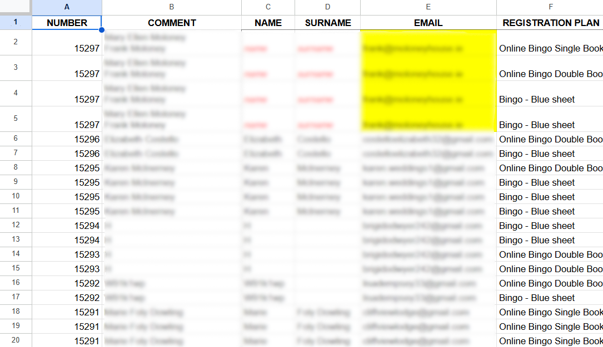

# Bingo with one click: Ecwid orders importer for Google Sheets

This Google Apps Script project enhances Google Sheets with a custom UI for importing and processing Ecwid order data, either from exported `.csv` files or directly via the Ecwid API. It automatically formats and organizes order information into structured Bingo and Lotto datasets.

## Features

- Import data manually from Ecwid `.csv` file or automatically via Ecwid API
- Upload files easily using drag-and-drop or file selection
- Update sheets automatically with all new orders since the last import
- Generate organized Bingo data tables for master file use and online vouchers management
- Create Lotto data tables to assist with filling out participant tickets
- Process data to simplify creating weekly Bingo lists
- Parse comments intelligently into separate names and surnames
- Validate email addresses and detect typos automatically
- Add clearly labeled emphasized columns, informative headers with order time ranges, and automatically adjusted widths for clean, readable sheets
- Clear data quickly and reset order tracking with built-in functionality

## How to Use

1. Once the Bingo & Lotto Script sheet is open and fully loaded, with the script in place, use the custom menu to manage Ecwid order data.

2. Import data to the sheet.

- To import data manually:
    - Log in to your Ecwid account and go to the Orders page.
    - Select all orders (the script will filter only the relevant ones later). 
    - Export as a `.csv` file using default options (all columns included, semicolon as delimiter).

        

    - In the sheet, go to `Import > Bingo Data > From file` or `Import > Lotto Data > From file`, and upload the file via selection or drag-and-drop.

        

- To import data automatically via API, go to `Import > Bingo Data > From API` or `Import > Lotto Data > From API`. The script tracks the last imported order and only adds new entries.

    

3. Imported data will appear in either the Bingo Data or Lotto Data sheet. After import, a confirmation message will appear summarizing the number of new entries and the categorized order details.

     

4. Bingo data is split into two parts: one for direct copy-paste into the master file (books), and one for handling online voucher distribution.

5. A Bingo List sheet is generated automatically from the Bingo data. Each Bingo book becomes a separate row.

     

6. Comments are used to extract names and surnames. If parsing fails, the row is marked in red italics for manual review. When editing a name or surname in a row, all rows from the same order will be updated as well.

7. Email addresses are validated. Any address with an unknown domain or incorrect format is highlighted in yellow.

8. To clear data and reset import tracking, use the `Clear` menu to remove previous Bingo or Lotto entries.

## Note

This project was developed for internal use within our organization and is not intended for public distribution or third-party usage. It is designed specifically to support internal processes like generating Bingo lists and managing order data within our company's shared Google Sheet.

The script relies on access to our corporate Google Drive and Ecwid store, so certain features—particularly the API-based import—will not work outside of this environment by default.

However, if you wish to adapt the script for use with your own Ecwid store, you can manually configure it by setting the required document properties:

- `storeID` – your Ecwid store ID
- `secretToken` – your Ecwid API token

These can be set using the built-in utility function `setDocumentProperty(key, value)` (from `Utilities.gs`). This function can be executed through the Apps Script console or by adding your own interface. Usage and adaptation outside of the original environment is at your own discretion.
